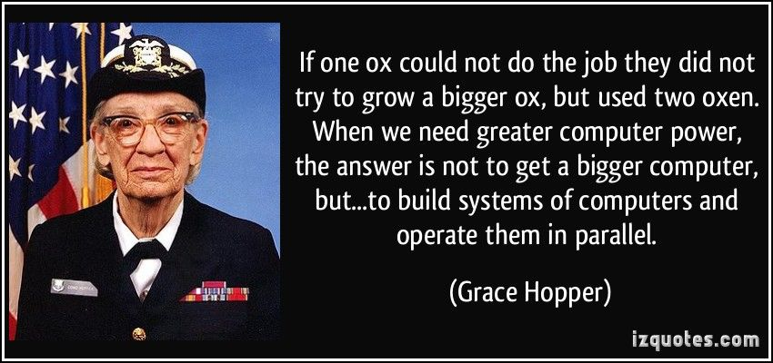

<h1 align="center" style="color:#8A2BE2"> HPC Performance Tools </h1>

## Overview

> Free lunch is over
> _Herb Sutter

The traditional approach to application was to simply wait for the next generation of processor, most software developers did not need to invest in performance tunning, and enjoyed a "free lunch" from hardware improvement.
Now ball is in programmers court.
What you can do about it?

**Transition from single-core to multicore, Heterogeneous cores and Elastic compute cloud cores**

This course is a graduate-level introduction to parallel computing. Its goal is to give you the foundations to develop, analyze, and implement parallel and locality-efficient algorithms for better use of all resources of the computer or HPC cluster.

## Grading
Below the table for the grading system for this module.
Topic | grading |
|---|---|
Practical Lab (participation grade) | 20% 
Project presentation                | 30% 
Final exam                          | 50%

 
<h2 align="center">Enjoy the coding journey</h2>
 

